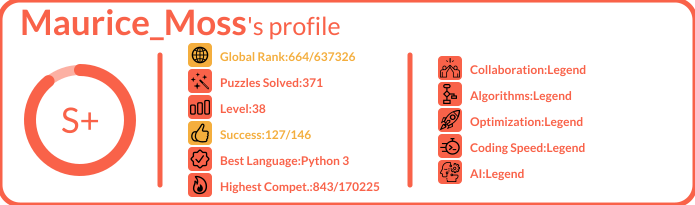

<p align="center">

<span style="font-size:24px;font-family:'Arial';font-weight:bold;color:#f2bb13">Readme Stats</span>
</p>
<hr>
<p align="center">
    
    
</p>


<p align="center">
    Inspired by <a href="https://github.com/anuraghazra/github-readme-stats" target="_blank">github-readme-stats</a>, I wanted to make a similar tool for codingame profiles. <br><br>
    
</p>

# How to use

### Get your profile stats

Copy-paste this code snippet into your markdown content, and that is it 👍.

Change the `<your_codingamer_id>` with your id. To get it, you need to get your codingamer ID that you can find in the url of your profile `https://www.codingame.com/profile/<your_codingamer_id>`

```md

```

### Select Offline or Online Competitions

You can select on your profile if you want to refer to online challenges or offline challenges (bot-programming). This can be set using the argument `online=true|false`. 

> Default: `online = false`

```md

```

# Maths

TBD

# Run locally -- Developer only

### Clone the repository

```sh
git clone https://github.com/Coni63/codingame-readme-stats.git
cd codingame-readme-stats
```

### Install the environment

```sh
cd api
python -m venv venv
venv/Scripts/activate.ps1
pip install -r requirements.txt
```

### Run the Flask application

You can run locally the application by running the following command and then go to
`http://localhost:8000/api/details/<your_codingamer_id>`. For the development, it is recommended to use the `your_codingamer_id "magic"`. It uses a local fake data instead of calling Codingame's API at every refresh.

```sh
cd api
venv/Scripts/activate.ps1
python app.py
```

### Run tests / coverage

You can run tests / coverage simply by running the following commands:

```sh
cd api
venv/Scripts/activate.ps1
coverage run -m unittest discover
```

If you want to go further, here is some usefull commands to use

```sh
coverage xml  # create the cobertura coverage.xml file -- do not commit it
coverage json # same file but in json -- do not commit it
coverage html # generate a htmlcov folder with coverage result as HTML file -- do not commit it
coverage report # get report in the console

python -m unittest discover # run only unittest and don't evaluate coverage
python -m unittest test_module1 test_module2  # run only some modules
python -m unittest test_module.TestClass      # run only one class in a module
python -m unittest test_module.TestClass.test_method # run only 1 test in a class
```

### Freeze the environment

In case you install a new dependency, don't forget to update the requirements.txt 😉

```sh
cd api
venv/Scripts/activate.ps1
pip freeze > requirements.txt
```


<!--https://nedbatchelder.com/blog/202209/making_a_coverage_badge.html-->
