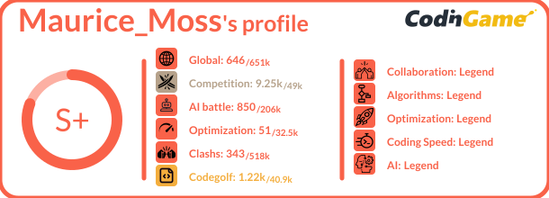
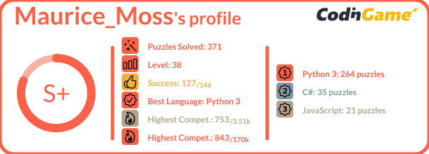
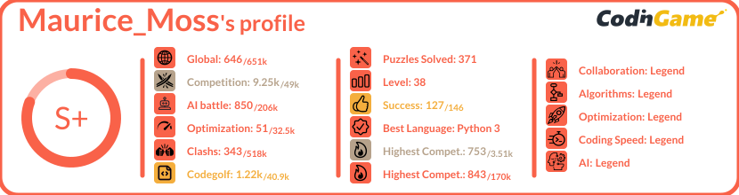

<p align="center">

<span style="font-size:24px;font-family:'Arial';font-weight:bold;color:#f2bb13">Readme Stats</span>
</p>


<hr>
<p align="center">
    
    
</p>


<p align="center">
    Inspired by <a href="https://github.com/anuraghazra/github-readme-stats" target="_blank">github-readme-stats</a>, I wanted to make a similar tool for codingame profiles. <br><br>
    
</p>


# How to use

### Get your profile stats

- Copy-paste this code snippet into your markdown content
```md

```

- Replace the `<your_codingamer_id>` with your id. your codingamer ID can be found in the url of your own profile `https://www.codingame.com/profile/<your_codingamer_id>`
- That is it 👍.

You can also use an `` tag with a width of:
- `width=390px` for a single column format 
- `width=610px` for a two-column format
- `width=830px` for a three-column format

```html

 

```

### Select Categories

You can decide to which content you want for every 'column'. Available options are:
- `certifications` : Current level on every certifications
- `languages` : Top  `n` languages to display with number of puzzle solved
- `leaderboard` : Current ranking on every categories and global 
- `puzzles` : Some figures based on puzzles completions

You can set the column using the arguments:
- `first` : default is leaderboard
- `second` : default is "hidden"
- `third` : default is "hidden"

Finally, if you use `languages`, you can limit the number of visible languages with `top=n` with 1 <= n <= 6 (default = 6))


```md

```
<p align="center">
    
</p>

```md

```
<p align="center">
    
</p>

```md

```
<p align="center">
    
</p>

```md

```
<p align="center">
    
</p>


# Current API limitation

In order to reduce the number of request to Codingame's APIs. 

- The result of the request is cached and will not change for 24 hours (Codingame's profiles are anyway updated only once a day).
- A restriction of call is applied per IP address:
  - 1 request every 5 seconds (this one may change as it could create issues if you put multiple badge on your profile)
  - 60 requests every hour
  - 200 requests every day
- The returned image should be cached by the browser


# Future versions

- add light / dark themes
- fix issue with CG's icon is single column format

Other ideas are welcome 😉

# Run locally -- Developer only

### Clone the repository

```sh
git clone https://github.com/Coni63/codingame-readme-stats.git
cd codingame-readme-stats
```

### Install the environment

```sh
cd api
python -m venv venv
venv/Scripts/activate.ps1
pip install -r requirements.txt
```

```sh
cd api
mkvirtualenv venv --python=/usr/bin/python3.10
workon venv
pip install -r requirements.txt
```

### Run the Flask application

You can run locally the application by running the following command and then go to
`http://localhost:8000/api/details/<your_codingamer_id>`. For the development, it is recommended to use the `your_codingamer_id "magic"`. It uses a local fake data instead of calling Codingame's API at every refresh.

```sh
cd api
venv/Scripts/activate.ps1  # or source venv/bin/activate or workon venv
python app.py
```

### Run tests / coverage

You can run tests / coverage simply by running the following commands:

```sh
cd api
venv/Scripts/activate.ps1  # or source venv/bin/activate or workon venv
coverage run -m unittest discover
```

If you want to go further, here is some usefull commands to use

```sh
coverage xml  # create the cobertura coverage.xml file -- do not commit it
coverage json # same file but in json -- do not commit it
coverage html # generate a htmlcov folder with coverage result as HTML file -- do not commit it
coverage report # get report in the console

python -m unittest discover # run only unittest and don't evaluate coverage
python -m unittest test_module1 test_module2  # run only some modules
python -m unittest test_module.TestClass      # run only one class in a module
python -m unittest test_module.TestClass.test_method # run only 1 test in a class
```

### Freeze the environment

In case you install a new dependency, don't forget to update the requirements.txt 😉

```sh
cd api
venv/Scripts/activate.ps1  # or source venv/bin/activate or workon venv
pip freeze > requirements.txt
```

### Other tutorials

- https://www.youtube.com/watch?v=4sTZN15J33A
- https://nedbatchelder.com/blog/202209/making_a_coverage_badge.html
