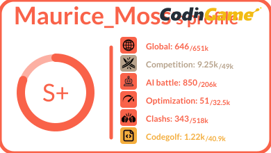
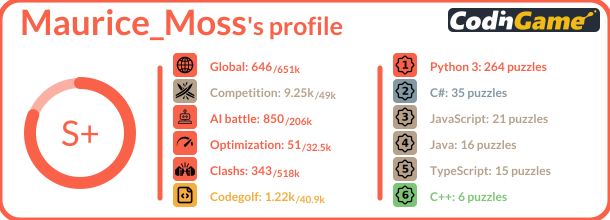

<p align="center">

<span style="font-size:24px;font-family:'Arial';font-weight:bold;color:#f2bb13">Readme Stats</span>
</p>
<hr>
<p align="center">
    
    
</p>


<p align="center">
    Inspired by <a href="https://github.com/anuraghazra/github-readme-stats" target="_blank">github-readme-stats</a>, I wanted to make a similar tool for codingame profiles. <br><br>
    
</p>

# How to use

### Get your profile stats

- Copy-paste this code snippet into your markdown content
```md

```
- Replace the `<your_codingamer_id>` with your id. your codingamer ID can be found in the url of your own profile `https://www.codingame.com/profile/<your_codingamer_id>`
- That is it 👍.

### Select Offline or Online Competitions

In your profile, you can choose to associate it with an online challenge or an offline challenge (bot-programming) using the argument `online=true|false`. 

> Default: `online = false`

```md

```
<p align="center">
    
</p>

### Select the second category

You can decide to display or not a second section. This is done by setting the argument `display=languages|certifications|none`. 

> Default: `display = none`

```md

```
<p align="center">
    
</p>

If `display=languages` you can use an extra argument `top=6` to specify the number of languages to display (max = 6)

> Default: `top = 6`

```md

```
<p align="center">
    
</p>

```md

```
<p align="center">
    
</p>

# Maths

### Color assignments

#### Global Rank

Rank colors are determined using a fixed threshold. The threshold is defined by capping only the top 25% of remaining players at each step. This is limited to the top 100,000 players.

The `Wood` level is the bottom 75%. The remaining players proceed to the next step. Of that 25% of players, the bottom 75% are `Bronze`. Repeat this until `Legend`.

The resulting threshold is:
```
Legend : top 390
Gold : top 1 562
Silver : top 6 250
Bronze : top 25 000
Wood : after 25 000
```

#### Puzzles Solved

The threshold for the number of puzzles solved is manually set. There's no API to easily collect this information for every player, hence there's no analytics behind it. As a result, the following thresholds apply:

```
Legend : more than 250 puzzles solved
Gold : more than 125 puzzles solved
Silver : more than 50 puzzles solved
Bronze : more than 25 puzzles solved
Wood : less than 25 puzzles solved
```

#### Best Language

As for the puzzle solved, the language with the most puzzles solved is used. Thresholds are also manually determined as there is no API to easily collect this information for every players. Also, I think the achievement in CG is too easy (15 puzzles for `Legend`). As a result, the following thresholds apply:

```
Legend : more than 100 puzzles solved with this language
Gold : more than 50 puzzles solved with this language
Silver : more than 25 puzzles solved with this language
Bronze : more than 10 puzzles solved with this language
Wood : less than 10 puzzles solved with this language
```

#### Level

As for the global rank, the level is defined using the capping method and a threshold of 40% (instead of 25%). Based on that, quantiles are computed on the top 100k players leading to those thresholds:

```
Legend : Level 31+
Gold : Level 24+
Silver : Level 16+
Bronze : Level 9+
Wood : Below Level 9
```

#### Success

The achievement value is the number of achievements the codingamer has (excluding social and language achievements). However, the color is based on the sum of a score for every achievement. A more difficult achievements award more points. The ratio of every available points compared to the user point is used to determine the color according to the same rules as the global rank. The limit is 67% (instead of 25%), resulting in the next threshold.

```
Legend : more than 79% of points
Gold : more than 70% of points
Silver : more than 55% of points
Bronze : more than 33% of points
Wood : less than 33% of points
```

#### Highest Competition

The level of the competition is based on the current rank. This rank is converted into CP (using the same formula as CG) using a fixed base of 5000. The highest competition (online or offline) is used and the score is compared to the following thresholds (equivalent to a rank based on the formula of the global rank and a limit of 40%):

```
Legend : above 4037 CP
Gold : above 2911 CP
Silver : above 1285 CP
Bronze : above 166 CP
Wood : below 166 CP
```

#### Certifications

The color is based on the level reached on Codingame. If the codingamer does not have a certification, it is mentioned as `wood` level.

### Main scoring fonction

To finish the final score is a score between 0 and 100 based on all the previous analysis. 

Every section has a weight of:

- 50 for the level
- 10 for every certifications (5 certifications in total)
- 2 for the top language
- 5 for the number of puzzle solved
- 20 for the number of achievements
- 100 for the global rank
- 50 for the highest competition

And the number of points is based on the level reached :

- 0 for `Wood`
- 1 for `Bronze`
- 2 for `Silver`
- 3 for `Gold`
- 4 for `Legend`

Then the score is calculated as follow:

$ score = 100 * \frac{\sum{level * weight}}{\sum{4 * weight}} $

Then thresholds are:

```
Legend : score above 85/100
Gold : score above 75/100
Silver : score above 50/100
Bronze : score above 25/100
Wood : score above 25/100
```

and the grade is using the following thresholds:

```
S++ : score above 95/100
S+ : score above 85/100
S : score above 75/100
A : score above 50/100
B : score above 25/100
C : score above 25/100
```

# Future versions

- add args to scale svg to a specific size

Other ideas are welcome 😉

# Run locally -- Developer only

### Clone the repository

```sh
git clone https://github.com/Coni63/codingame-readme-stats.git
cd codingame-readme-stats
```

### Install the environment

```sh
cd api
python -m venv venv
venv/Scripts/activate.ps1
pip install -r requirements.txt
```

```sh
cd api
mkvirtualenv venv --python=/usr/bin/python3.10
workon venv
pip install -r requirements.txt
```

### Run the Flask application

You can run locally the application by running the following command and then go to
`http://localhost:8000/api/details/<your_codingamer_id>`. For the development, it is recommended to use the `your_codingamer_id "magic"`. It uses a local fake data instead of calling Codingame's API at every refresh.

```sh
cd api
venv/Scripts/activate.ps1  # or source venv/bin/activate or workon venv
python app.py
```

### Run tests / coverage

You can run tests / coverage simply by running the following commands:

```sh
cd api
venv/Scripts/activate.ps1  # or source venv/bin/activate or workon venv
coverage run -m unittest discover
```

If you want to go further, here is some usefull commands to use

```sh
coverage xml  # create the cobertura coverage.xml file -- do not commit it
coverage json # same file but in json -- do not commit it
coverage html # generate a htmlcov folder with coverage result as HTML file -- do not commit it
coverage report # get report in the console

python -m unittest discover # run only unittest and don't evaluate coverage
python -m unittest test_module1 test_module2  # run only some modules
python -m unittest test_module.TestClass      # run only one class in a module
python -m unittest test_module.TestClass.test_method # run only 1 test in a class
```

### Freeze the environment

In case you install a new dependency, don't forget to update the requirements.txt 😉

```sh
cd api
venv/Scripts/activate.ps1  # or source venv/bin/activate or workon venv
pip freeze > requirements.txt
```

### Other tutorials

- https://www.youtube.com/watch?v=4sTZN15J33A
- https://nedbatchelder.com/blog/202209/making_a_coverage_badge.html
